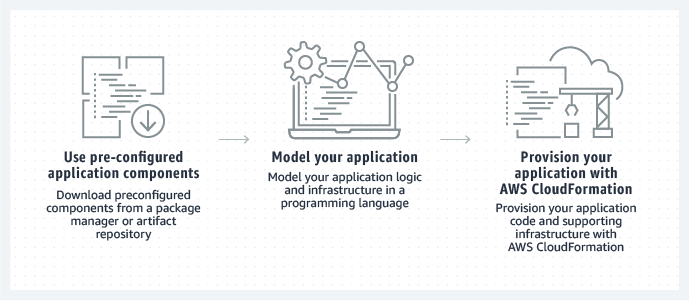

= AWS CDK demo

.Project introduction
****
This project is created to demonstrate how-to deploy to AWS using IaC (Java and CDK).

We start simpe by just deploying a simple lambda function. Going on to deploy an Quarks application with MicroProfile to get an REST endpoint.

As we like to persist data in our REST endpoint we add DynamoDb.

By default AWS do not support JDK 17 and we add a JDK 17 layer to be able to use JDK 17 in our application.

As we expect our application to really take of we add an ApplicationLoadBalancer in front and see how we now have done a "hot deployment" via the health endpoint.

All code in this demo will be in Java - IaC and the application.
****

== Demo steeps

- Introduction to AWS CDK
- aws-cdk-demo-simple-lambda
- aws-cdk-demo-hello-world-http
- aws-cdk-demo-hello-world-rest
- todo-app-h2
- aws-cdk-demo-st
- aws-cdk-demo
- aws-cdk-demo-dynamodb-todo
- aws-cdk-demo-dynamodb-todo-jdk17
- aws-cdk-demo-dynamodb-todo-jdk17-alb
- aws-cdk-demo-dynamodb-todo-jdk17-sam (only on request)

== Introduction to AWS CDK

.What is

****
The AWS Cloud Development Kit (AWS CDK) is an open-source software development framework to define your cloud application resources using familiar programming languages.
****

.Key concepts

****
An AWS CDK app is an application written in TypeScript, JavaScript, Python, Java, C# or Go that uses the AWS CDK to define AWS infrastructure. An app defines one or more stacks. Stacks (equivalent to AWS CloudFormation stacks) contain constructs, each of which defines one or more concrete AWS resources, such as Amazon S3 buckets, Lambda functions, Amazon DynamoDB tables, and so on.
****

.Supported programming languages

****
The AWS CDK has first-class support for TypeScript, JavaScript, Python, Java, C#, and Go. Other JVM and .NET CLR languages may also be used, at least in theory, but we are unable to offer support for them at this time.
****

.How it works

[CDK]

.Links

- https://docs.aws.amazon.com/cdk/v2/guide/apps.html#lifecycle[Apps -> App lifecycle]
- https://aws.amazon.com/cdk/[AWS Cloud Development Kit]
- https://docs.aws.amazon.com/cdk/v2/guide/getting_started.html[Getting started with the AWS CDK]
- https://docs.aws.amazon.com/cdk/v2/guide/work-with-cdk-java.html[Working with the AWS CDK in Java]

== aws-cdk-demo-simple-lambda

- Show the lambda funtion
- Show the CKD code (including cdk.json)
- Show `cdk diff` after change to function
- Do live deployment to AWS
- Use/Test lambda function

.Lambda function

[source,java]
----
public String onEvent(Map<String, String> event) {
    System.out.println("received: " + event);
    return event
       .entrySet()
       .stream()
       .map(e -> e.getKey() + "->" + e.getValue())
       .collect(Collectors.joining(","));
}
----

.Build and deploy funtion with AWS CDK

[source,bash]
----
#!/bin/sh
set -e

echo "building functions"
mvn clean package

echo "building and deploy - CDK"
cd cdk && mvn clean package && cdk deploy $PROFILE
----

.Output of `cdk diff` after change to function (mvn clean package)
----
Stack aws-lambda-cdk-plain
Resources
[~] AWS::Lambda::Function dk_jarry_aws_lambda_greetings_boundary_Greetings dkjarryawslambdagreetingsboundaryGreetingsDCA7FDA8 
 ├─ [~] Code
 │   └─ [~] .S3Key:
 │       ├─ [-] 4efad5ac647d6e70d8b21628811edfdb86f9042902d462bcb70ccd8bf4c1ab98.jar
 │       └─ [+] 8a6de566201c0ce68f1b15fab8bad8ed5215fa850b74d7325af9bb8b1493691e.jar
 └─ [~] Metadata
     └─ [~] .aws:asset:path:
         ├─ [-] asset.4efad5ac647d6e70d8b21628811edfdb86f9042902d462bcb70ccd8bf4c1ab98.jar
         └─ [+] asset.8a6de566201c0ce68f1b15fab8bad8ed5215fa850b74d7325af9bb8b1493691e.jar
----

.Testing
- UnitTest
- https://eu-central-1.console.aws.amazon.com/lambda/home?region=eu-central-1#/functions/dk_jarry_aws_lambda_greetings_boundary_Greetings?tab=testing[Test function in AWS]

.Code pick
[source,bash]
----
cd ~/git/jarrydk/aws-cdk-demo/aws-cdk-demo-simple-lambda && code -n .
----

== aws-cdk-demo-hello-world-http

- Show the Quarkus app with MicroProfile
- Show how to test the app on localhost
- Show the CKD code (http)

[sourch,bash]

.Create the application

----
mvn io.quarkus.platform:quarkus-maven-plugin:2.11.2.Final:create \
    -DprojectGroupId=dk.jarry.aws \
    -DprojectArtifactId=aws-cdk-demo-hello-world-http \
    -DclassName="dk.jarry.aws.HelloResource" \
    -Dpath="/hello" \
    -Dextensions="quarkus-resteasy"
----

.pom.xml
[source,xml]
----
<dependency>
    <groupId>io.quarkus</groupId>
    <artifactId>quarkus-amazon-lambda-http</artifactId>
</dependency>
----

.Rest endpoint

[source,java]
----
@Path("/hello")
public class HelloResource {

    @Inject
    @ConfigProperty(defaultValue = "hello, quarkus on localhost", name="message")
    String message;

    @GET
    @Produces(MediaType.TEXT_PLAIN)
    public String hello() {
        return message;
    }
}
----

.Local demo

http://localhost:8080/hello

Expected output : `hello, quarkus on localhost`

.Add the endpoint via CDK

[source,java]
----
var functionUrl = function.addFunctionUrl(
    FunctionUrlOptions
        .builder()
        .authType(FunctionUrlAuthType.NONE)
        .build());
----

.AWS demo

http://<HOST_NAME>/hello

Expected output : `Hello World - Quarkus as AWS Lambda`

.Code pick
[source,bash]
----
cd ~/git/jarrydk/aws-cdk-demo/aws-cdk-demo-hello-world-http && code -n .
----

== aws-cdk-demo-hello-world-rest

- Show the CKD code (rest)

.Create the application

----
mvn io.quarkus.platform:quarkus-maven-plugin:2.11.2.Final:create \
    -DprojectGroupId=dk.jarry.aws \
    -DprojectArtifactId=aws-cdk-demo-hello-world-http \
    -DclassName="dk.jarry.aws.HelloResource" \
    -Dpath="/hello" \
    -Dextensions="quarkus-resteasy"
----

.pom.xml
[source,xml]
----
<dependency>
    <groupId>io.quarkus</groupId>
    <artifactId>quarkus-amazon-lambda-rest</artifactId>
</dependency>
----

.Rest endpoint

[source,java]
----
@Path("/hello")
public class HelloResource {

    @Inject
    @ConfigProperty(defaultValue = "hello, quarkus on localhost", name="message")
    String message;

    @GET
    @Produces(MediaType.TEXT_PLAIN)
    public String hello() {
        return message;
    }
}
----

.Add the endpoint

[source,java]
----
var apiGateway = LambdaRestApi.Builder
                    .create(this, "RestApiGateway")
                    .handler(function)
                    .build();
----

.Code pick
[source,bash]
----
cd ~/git/jarrydk/aws-cdk-demo/aws-cdk-demo-hello-world-rest && code -n .
----

== todo-app-h2

- Introduce the ToDo Quarkus application.
- Start the ToDo Quarkus application on localhost.

.Start app in dev mode

[source,bash]
----
mvn compile quarkus:dev
----

.Code pick
[source,bash]
----
cd ~/git/jarrydk/aws-cdk-demo/todo-app-h2 && code -n .
----

== aws-cdk-demo-st

TIP: todo-app-h2 app need to be up running before going forward. 

- Introduce the ToDo SystemTest.

.Start app in dev mode

[source,bash]
----
mvn compile quarkus:dev
----

.Start app in dev mode - change endpoint

[source,bash]
----
mvn compile quarkus:dev -Dquarkus.rest-client.extensions-api.url=http://localhost:8080
----

.Code pick
[source,bash]
----
cd ~/git/jarrydk/aws-cdk-demo/aws-cdk-demo-st && code -n .
----

== aws-cdk-demo

TIP: Upload the java17layer.zip to the bucket `aws-cdk-demo-lamda-layers` with the script `s3_upload_java17layers_to_aws-cdk-demo-lamda-layers.sh` before creating the layer.

- Show how to create a DynamoDB table (L1)
- Show how to create a Role (L2)
- Show how to create a Bucket (L1)
- Show how to create a Layer (L1)

https://docs.aws.amazon.com/cdk/v2/guide/getting_started.html#getting_started_concepts[Getting started with the AWS CDK -> Key concepts]

.Code pick
[source,bash]
----
cd ~/git/jarrydk/aws-cdk-demo/aws-cdk-demo && code -n .
----

== aws-cdk-demo-dynamodb-todo

- Show how the app is using DynamoDB
- Show how to test the app on localhost
- Show how to create the DynamoDB database and table for AWS
- Show how to create a Role for AWS and use it

.Start a DynamoDB container on "localhost"
[source,bash]
----
podman run -it \
     --publish 8000:8000 \
     amazon/dynamodb-local:1.11.477 \
     -jar DynamoDBLocal.jar -inMemory -sharedDb
----

Access : http://localhost:8000/shell

.Create the table 'todos' in DynamoDB
[source,javascript]
----
var params = {
    TableName: 'ToDos',
    KeySchema: [{ AttributeName: 'uuid', KeyType: 'HASH' }],
    AttributeDefinitions: [{  AttributeName: 'uuid', AttributeType: 'S', }],
    ProvisionedThroughput: { ReadCapacityUnits: 1, WriteCapacityUnits: 1, }
};
dynamodb.createTable(params, function(err, data) {
    if (err) ppJson(err);
    else ppJson(data);

});
----

.Code pick
[source,bash]
----
cd ~/git/jarrydk/aws-cdk-demo/aws-cdk-demo-dynamodb-todo && code -n .
----

== aws-cdk-demo-dynamodb-todo-jdk17

- Show how to add a java17 layer

.Code pick
[source,bash]
----
cd ~/git/jarrydk/aws-cdk-demo/aws-cdk-demo-dynamodb-todo-jdk17 && code -n .
----

== aws-cdk-demo-dynamodb-todo-jdk17-alb

- Show how to setup ApplicationLoadBalancer
- Manual enable `enable-multi-value-header`

.Code pick
[source,bash]
----
cd ~/git/jarrydk/aws-cdk-demo/aws-cdk-demo-dynamodb-todo-jdk17-alb && code -n .
----

== aws-cdk-demo-dynamodb-todo-jdk17-sam (only on request)

Same as `aws-cdk-demo-dynamodb-todo-jdk17` but deployed via https://aws.amazon.com/serverless/sam/[SAM].

== Java 17 layer

Build the java17layer layer from https://github.com/msailes/lambda-java17-layer or use the one in this project.

== Tests from command line

.Create a ToDo

[source,bash]
----
curl -X POST http://localhost:8080/todos \
	-H 'Accept: application/json' \
	-H 'Content-Type: application/json' \
	-d '{"subject":"Hello from Quarkus","body":"Content"}'
----

[source,bash]
----
./create_todo.sh http://localhost:8080/todos
----

.Read a ToDo

[source,bash]
----
curl http://localhost:8080/todos/db50ec51-99cf-4972-a435-50ea3701c78a
----

[source,bash]
----
./read_todo.sh http://localhost:8080/todos db50ec51-99cf-4972-a435-50ea3701c78a
----

== CDK commands

- `cdk ls` list all stacks in the app
- `cdk synth` emits the synthesized CloudFormation template
- `cdk deploy` deploy this stack to your default AWS account/region
- `cdk diff` compare deployed stack with current state
- `cdk docs` open CDK documentation

== Pulumi

[source,java]
----
import com.pulumi.Pulumi;
import com.pulumi.aws.s3.Bucket;

public class App {
    public static void main(String[] args) {
        Pulumi.run(ctx -> {

            // Create an AWS resource (S3 Bucket)
            var bucket = new Bucket("my-bucket");

            // Export the name of the bucket
            ctx.export("bucketName", bucket.getId());
        });
    }
}
----

Source: https://www.pulumi.com/docs/get-started/aws/review-project/

== Links

- https://docs.aws.amazon.com/cdk/api/v2/java/index.html
- https://docs.aws.amazon.com/lambda/latest/dg/configuration-layers.html
- https://docs.aws.amazon.com/elasticloadbalancing/latest/application/lambda-functions.html#enable-multi-value-headers
- https://github.com/aws-samples/aws-cdk-examples/tree/master/java
- https://docs.aws.amazon.com/cdk/api/v2/java/software/amazon/awscdk/services/lambda/CfnLayerVersion.html
- https://docs.aws.amazon.com/cli/latest/userguide/cli-services-s3-commands.html

- https://quarkus.io/
- https://thorben-janssen.com/generate-uuids-primary-keys-hibernate/
- https://stackoverflow.com/questions/6356834/using-hibernate-uuidgenerator-via-annotations

